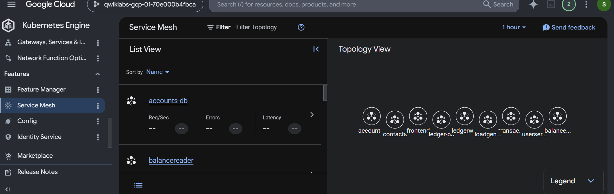
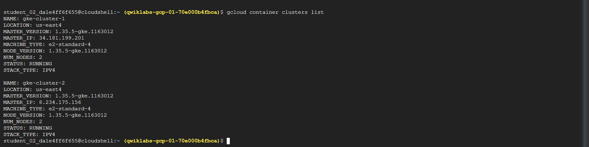
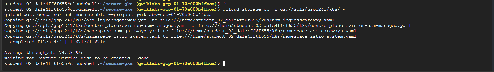
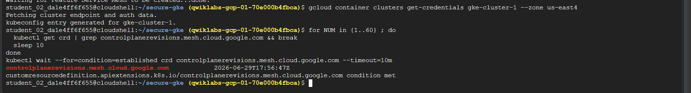
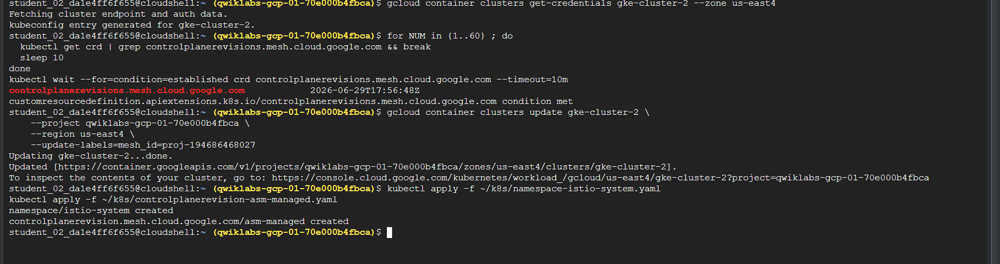
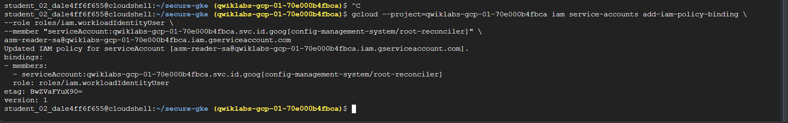
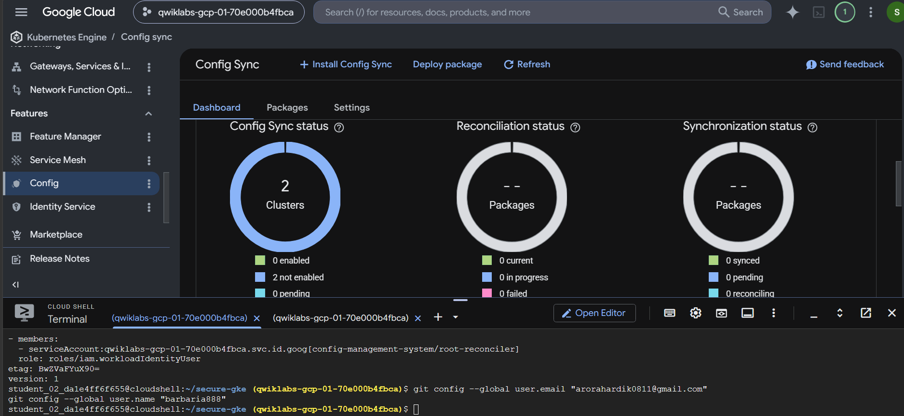
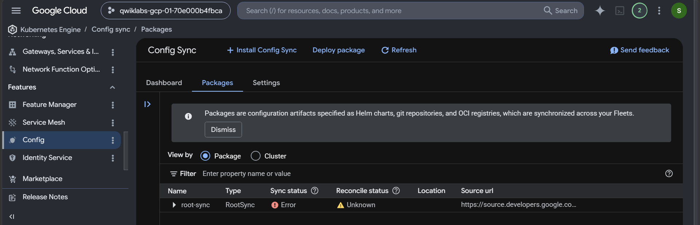
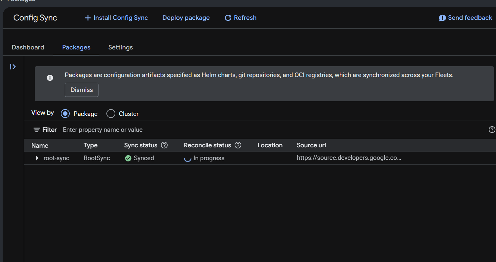

# 📘 Automate GKE Configurations with Config Sync

Welcome to the **Automate GKE Configurations with Config Sync** lab guide. This repository contains the step-by-step execution pipeline to provision a multi-cluster GKE environment, integrate Anthos Service Mesh (ASM), and leverage Config Sync for GitOps-driven cluster configuration management.

---

## 🏗️ Architectural Overview

Config Sync is a GitOps-centric service designed to continuously reconcile the state of your Google Kubernetes Engine (GKE) clusters with declarative configurations stored in a Git repository. This paradigm ensures that your Kubernetes infrastructure is robust, auditable, and immutable.

<p align="center">
  
</p>

### Objective
By the end of this deployment, you will have:
1. Provisioned dual GKE Standard clusters.
2. Enabled and configured Anthos Service Mesh.
3. Installed and configured Config Sync to deploy microservices from a centralized Git repository.

---

## 🚀 Phase 1: Infrastructure Provisioning & Service Mesh Enablement

In this phase, we establish the foundational infrastructure, enabling essential APIs and deploying the GKE clusters.

### 1. Enable Required APIs

Activate the necessary Google Cloud Service APIs to support hybrid cloud capabilities, Kubernetes operations, and the Cloud Operations suite.

```bash
gcloud services enable \
--project=$DEVSHELL_PROJECT_ID \
anthos.googleapis.com \
anthosconfigmanagement.googleapis.com \
container.googleapis.com \
stackdriver.googleapis.com \
monitoring.googleapis.com \
cloudtrace.googleapis.com \
logging.googleapis.com \
meshca.googleapis.com \
meshtelemetry.googleapis.com \
meshconfig.googleapis.com \
multiclustermetering.googleapis.com \
multiclusteringress.googleapis.com \
multiclusterservicediscovery.googleapis.com \
iamcredentials.googleapis.com \
iam.googleapis.com \
gkeconnect.googleapis.com \
gkehub.googleapis.com \
compute.googleapis.com \
sourcerepo.googleapis.com \
osconfig.googleapis.com \
trafficdirector.googleapis.com \
networkservices.googleapis.com \
mesh.googleapis.com \
cloudresourcemanager.googleapis.com
```

### 2. Provision GKE Clusters

Deploy two independent GKE standard clusters. We use the `--async` flag for the first cluster to parallelize the provisioning process.

```bash
gcloud container clusters create "gke-cluster-1" \
--node-locations us-east4-c \
--location us-east4 \
--num-nodes "2" --min-nodes "2" --max-nodes "2" \
--workload-pool "$DEVSHELL_PROJECT_ID.svc.id.goog" \
--enable-ip-alias \
--machine-type "e2-standard-4" \
--node-labels mesh_id=proj-194686468027 \
--labels mesh_id=proj-194686468027 \
--fleet-project=$DEVSHELL_PROJECT_ID --async

gcloud container clusters create "gke-cluster-2" \
--node-locations us-east4-c \
--location us-east4 \
--num-nodes "2" --min-nodes "2" --max-nodes "2" \
--workload-pool "$DEVSHELL_PROJECT_ID.svc.id.goog" \
--enable-ip-alias \
--machine-type "e2-standard-4" \
--node-labels mesh_id=proj-194686468027 \
--labels mesh_id=proj-194686468027 \
--fleet-project=$DEVSHELL_PROJECT_ID
```

> [!WARNING]
> The initial provisioning phase can take up to ten minutes while the Google API allocates the control plane master instances. Do not interrupt the shell process.

Verify the operational status of the clusters:

```bash
gcloud container clusters list
```

<p align="center">
  
</p>

Set up the workspace directory:

```bash
mkdir -p secure-gke && cd secure-gke && export WORKDIR=$(pwd)
```

---

## 🕸️ Phase 2: Anthos Service Mesh Integration

Integrate the managed Anthos Service Mesh (ASM) across both clusters to enable secure, observable cross-cluster communication.

### 1. Enable the Mesh on the Fleet

```bash
gcloud storage cp -r gs://spls/gsp1241/k8s/ ~
gcloud beta container hub mesh enable --project=$DEVSHELL_PROJECT_ID
```

<p align="center">
  
</p>

### 2. Configure Cluster 1 (`gke-cluster-1`)

Retrieve cluster credentials and verify the Custom Resource Definition (CRD) establishment.

```bash
gcloud container clusters get-credentials gke-cluster-1 --zone us-east4

for NUM in {1..60} ; do
  kubectl get crd | grep controlplanerevisions.mesh.cloud.google.com && break
  sleep 10
done
kubectl wait --for=condition=established crd controlplanerevisions.mesh.cloud.google.com --timeout=10m
```

<p align="center">
  
</p>

Apply the mesh taxonomy label and instantiate the control plane:

```bash
gcloud container clusters update gke-cluster-1 \
    --project $DEVSHELL_PROJECT_ID \
    --region us-east4 \
    --update-labels=mesh_id=proj-194686468027 

kubectl apply -f ~/k8s/namespace-istio-system.yaml
kubectl apply -f ~/k8s/controlplanerevision-asm-managed.yaml
```

Wait for the managed control plane to finalize provisioning:

```bash
kubectl wait --for=condition=ProvisioningFinished controlplanerevision asm-managed -n istio-system --timeout 600s
```

> [!NOTE]
> ASM control plane reconciliation can take up to ten minutes. Ensure the `ProvisioningFinished` condition is met before proceeding.

Deploy the ASM Ingress Gateway:

```bash
kubectl apply -f ~/k8s/namespace-asm-gateways.yaml
kubectl apply -f ~/k8s/asm-ingressgateway.yaml
```

### 3. Configure Cluster 2 (`gke-cluster-2`)

Replicate the Service Mesh injection on the secondary cluster.

```bash
gcloud container clusters get-credentials gke-cluster-2 --zone us-east4

for NUM in {1..60} ; do
  kubectl get crd | grep controlplanerevisions.mesh.cloud.google.com && break
  sleep 10
done
kubectl wait --for=condition=established crd controlplanerevisions.mesh.cloud.google.com --timeout=10m

gcloud container clusters update gke-cluster-2 \
    --project $DEVSHELL_PROJECT_ID \
    --region us-east4 \
    --update-labels=mesh_id=proj-194686468027 

kubectl apply -f ~/k8s/namespace-istio-system.yaml
kubectl apply -f ~/k8s/controlplanerevision-asm-managed.yaml

kubectl wait --for=condition=ProvisioningFinished controlplanerevision asm-managed -n istio-system --timeout 600s

kubectl apply -f ~/k8s/namespace-asm-gateways.yaml
kubectl apply -f ~/k8s/asm-ingressgateway.yaml
```

<p align="center">
  
</p>

---

## 🔐 Phase 3: IAM & GitOps Configuration Setup

Before deploying Config Sync, establish Workload Identity bindings to securely authorize the Kubernetes service accounts.

```bash
gcloud --project=$DEVSHELL_PROJECT_ID iam service-accounts add-iam-policy-binding \
--role roles/iam.workloadIdentityUser \
--member "serviceAccount:$DEVSHELL_PROJECT_ID.svc.id.goog[config-management-system/root-reconciler]" \
asm-reader-sa@$DEVSHELL_PROJECT_ID.iam.gserviceaccount.com
```

<p align="center">
  
</p>

Initialize your local Git client:

```bash
git config --global user.email "you@example.com"
git config --global user.name "Your Name"
```

---

## 🔄 Phase 4: Install and Configure Config Sync

With the infrastructure stabilized, instantiate the Config Sync controllers to manage Kubernetes resources directly from a centralized repository.

### 1. Console Configuration
1. Navigate to the **Kubernetes Engine > Config** dashboard.
2. Click **Install Config Sync** and select **Manual upgrades**.
3. Select both clusters and apply the installation.

Wait until the status reflects **Enabled** on both clusters.

<p align="center">
  
</p>

### 2. Deploy the Root Sync Package
1. On the Dashboard, click **Deploy Package**.
2. Select both clusters and choose **Package hosted on Git**.
3. Enter `root-sync` as the Package name.
4. Supply the Repository URL: `https://source.developers.google.com/p/$DEVSHELL_PROJECT_ID/r/acm-repo`
5. Branch: `main`
6. Under Advanced Settings:
   - **Authentication type**: Workload Identity
   - **GCP service account email**: `asm-reader-sa@$DEVSHELL_PROJECT_ID.iam.gserviceaccount.com`
   - **Source format**: Hierarchy

> [!NOTE]
> Initially, the Sync status column will display an **Error**. This is anticipated behavior, as the repository does not yet contain the expected manifest structure.

<p align="center">
  
</p>

### 3. CLI Validation & Context Configuration

Ensure the `nomos` command-line tool is installed to debug and monitor Config Sync status.

```bash
touch ~/secure-gke/asm-kubeconfig && export KUBECONFIG=~/secure-gke/asm-kubeconfig
gcloud container clusters get-credentials gke-cluster-1 --zone us-east4
gcloud container clusters get-credentials gke-cluster-2 --zone us-east4
kubectl config rename-context gke_${DEVSHELL_PROJECT_ID}_us-east4_gke-cluster-1 gke-cluster-1
kubectl config rename-context gke_${DEVSHELL_PROJECT_ID}_us-east4_gke-cluster-2 gke-cluster-2

gsutil cp gs://config-management-release/released/latest/linux_amd64/nomos ~/secure-gke/nomos && chmod +x ~/secure-gke/nomos
export NOMOS=~/secure-gke/nomos
$NOMOS version
```

---

## 📦 Phase 5: Application Deployment via GitOps

Push the declarative manifestations for the Cymbal Bank application to your central repository. Config Sync will automatically detect the commit and mutate the cluster states.

### 1. Push Application Configurations

```bash
gcloud source repos clone acm-repo --project=$DEVSHELL_PROJECT_ID
gcloud storage cp -r gs://spls/gsp1241/acm-repo/ ~/secure-gke/
cd ~/secure-gke/acm-repo/

git checkout -b main
git add .
git commit -am "Cymbal Bank application deployment"
git push -u origin main
```

### 2. Scaffold Namespaces & Service Accounts

Explicitly create the required Kubernetes service accounts across the application namespaces to adhere to least privilege identity models.

**For `gke-cluster-1`:**
```bash
gcloud container clusters get-credentials gke-cluster-1 --zone us-east4 --project $DEVSHELL_PROJECT_ID

kubectl create serviceaccount bank-of-anthos --namespace balance-reader
kubectl create serviceaccount bank-of-anthos --namespace contacts
kubectl create serviceaccount bank-of-anthos --namespace frontend
kubectl create serviceaccount bank-of-anthos --namespace ledger-writer
kubectl create serviceaccount bank-of-anthos --namespace transaction-history
kubectl create serviceaccount bank-of-anthos --namespace userservice
```

**For `gke-cluster-2`:**
```bash
gcloud container clusters get-credentials gke-cluster-2 --zone us-east4 --project $DEVSHELL_PROJECT_ID

kubectl create serviceaccount bank-of-anthos --namespace balance-reader
kubectl create serviceaccount bank-of-anthos --namespace contacts
kubectl create serviceaccount bank-of-anthos --namespace frontend
kubectl create serviceaccount bank-of-anthos --namespace ledger-writer
kubectl create serviceaccount bank-of-anthos --namespace transaction-history
kubectl create serviceaccount bank-of-anthos --namespace userservice
```

### 3. Verify Synchronization & Application Routing

Verify the Config Sync status in the console. Both sync and reconcile states should eventually display as **Synced** and **Current**.

<p align="center">
  
</p>

Retrieve the ASM Ingress Gateway external IP addresses to validate traffic routing into the service mesh:

```bash
export ASM_INGRESS_IP_CLUSTER_1=$(kubectl --context=gke-cluster-1 -n asm-gateways get svc asm-ingressgateway -ojsonpath='{.status.loadBalancer.ingress[].ip}')
echo -e "ASM_INGRESS_IP_CLUSTER_1 is ${ASM_INGRESS_IP_CLUSTER_1}"

export ASM_INGRESS_IP_CLUSTER_2=$(kubectl --context=gke-cluster-2 -n asm-gateways get svc asm-ingressgateway -ojsonpath='{.status.loadBalancer.ingress[].ip}')
echo -e "ASM_INGRESS_IP_CLUSTER_2 is ${ASM_INGRESS_IP_CLUSTER_2}"
```

> [!TIP]
> Navigate to the printed IP addresses in your browser to confirm the successful rendering of the Cymbal Bank application frontend.

---
